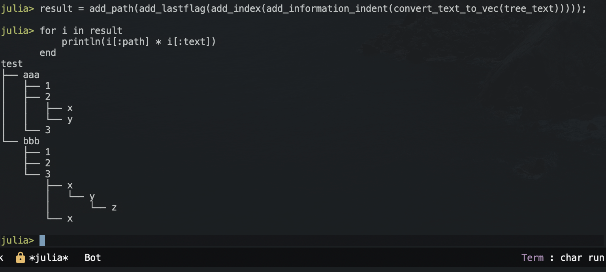

# 概要
treeコマンドなどで表示されるツリー形式の表示方法は階層構造を視覚化でき、わかりやすいので案件等でもディレクトリ構成を説明する際に良く使っています。

一方、この treeコマンドは当然ながら既にある階層的なディレクトリしか表示することができません。例えばコンフルエンス等の階層構造を説明する際ツリー形式に視覚的に綺麗に表示できれば良いとは思っても、treeコマンドが使えるはずもなくもどかしく思います。

そこで「箇条書き」→「ツリー形式」に変換するスクリプトをJuliaで作りました。

## なぜJulia？
全くもって特に理由はないです。

# 問題設定
```
- test
  - aaa
    - 1
    - 2
      - x
      - y
    - 3
  - bbb
    - 1
    - 2
    - 3
      - x
        - y
          - z
      - x
```
↑上記箇条書きを、↓下記ツリー形式に変換するスクリプト
```
test
├── aaa
│   ├── 1
│   ├── 2
│   │   ├── x
│   │   └── y
│   └── 3
└── bbb
    ├── 1
    ├── 2
    └── 3
        ├── x
        │   └── y
        │       └── z
        └── x
```
# スクリプトについて
上記問題をJuliaで解決するスクリプトを作成しました。

## ターゲットとなる文章
```julia
#=
今回のターゲットとなる箇条書き。
もちろん外部ファイルを読み込む形式にしても良い。
=#
tree_text = "- test
  - aaa
    - 1
    - 2
      - x
      - y
    - 3
  - bbb
    - 1
    - 2
    - 3
      - x
        - y
          - z
      - x"
```
一旦問題となる箇条書きをベタ書きしました。もちろん外部ファイルに列挙し、Juliaから read関数を用いて読み込む形式にしても問題ありません。 今回のコードでは- xxxxxで構成される箇条書きと、正しく配置されたインデントと改行コード \nがあれば対応できます。

## Juliaスクリプトについて
いくつか箇条書きを解析し、ツリー構造を構築するための関数を作成しました。

    """
        convert_text_to_vec(text)
    
    textを改行で分割し、箇条書きの記号を消す処理
    
    # Examples
    ```julia-repl
    julia> tree_text = "- test
      - aaa
        - 1
        - 2
          - x
          - y
        - 3
      - bbb
        - 1
        - 2
        - 3
          - x
            - y
              - z
          - x";
    julia> convert_text_to_vec(tree_text)
    15-element Vector{SubString{String}}:
     "test"
     "  aaa"
     "    1"
     "    2"
     "      x"
     "      y"
     "    3"
     "  bbb"
     "    1"
     "    2"
     "    3"
     "      x"
     "        y"
     "          z"
     "      x"
    ```
    """
    convert_text_to_vec(text) = split(replace(text, "- " => ""), "\n")
    """
        add_information_indent(data)
    
    `convert_text_to_vec` を用いてVector化したテキストのインデント情報を集計する
    
    # Examples
    ```julia-repl
    julis> add_information_indent(convert_text_to_vec(tree_text))
    15-element Vector{Dict}:
     Dict{Symbol, Any}(:indent => 0, :text => "test")
     Dict{Symbol, Any}(:indent => 1, :text => "aaa")
     Dict{Symbol, Any}(:indent => 2, :text => "1")
     Dict{Symbol, Any}(:indent => 2, :text => "2")
     Dict{Symbol, Any}(:indent => 3, :text => "x")
     Dict{Symbol, Any}(:indent => 3, :text => "y")
     Dict{Symbol, Any}(:indent => 2, :text => "3")
     Dict{Symbol, Any}(:indent => 1, :text => "bbb")
     Dict{Symbol, Any}(:indent => 2, :text => "1")
     Dict{Symbol, Any}(:indent => 2, :text => "2")
     Dict{Symbol, Any}(:indent => 2, :text => "3")
     Dict{Symbol, Any}(:indent => 3, :text => "x")
     Dict{Symbol, Any}(:indent => 4, :text => "y")
     Dict{Symbol, Any}(:indent => 5, :text => "z")
     Dict{Symbol, Any}(:indent => 3, :text => "x")
    ```
    """
    function add_information_indent(data)
        result = Vector{Dict}()
        length_space = []
        for v in data
            temp = lstrip(v)
            space = replace(v, temp => "")
            push!(length_space, length(space))
        end
        min_space = minimum([i for i in length_space if i > 0])
        for (i, j) in zip(lstrip.(data), length_space)
            push!(result, Dict(:indent => Int(j/min_space),
                               :text   => String(i)))
        end
        return result
    end
    """
        add_index(data)
    
    `convert_text_to_vec` と `add_information_indent` を用いてVector化したテキストのインデックス情報を集計する
    
    # Examples
    ```julia-repl
    julia> add_index(add_information_indent(convert_text_to_vec(tree_text)))
    15-element Vector{Dict}:
     Dict{Symbol, Any}(:index => 1, :indent => 0, :text => "test")
     Dict{Symbol, Any}(:index => 2, :indent => 1, :text => "aaa")
     Dict{Symbol, Any}(:index => 3, :indent => 2, :text => "1")
     Dict{Symbol, Any}(:index => 4, :indent => 2, :text => "2")
     Dict{Symbol, Any}(:index => 5, :indent => 3, :text => "x")
     Dict{Symbol, Any}(:index => 6, :indent => 3, :text => "y")
     Dict{Symbol, Any}(:index => 7, :indent => 2, :text => "3")
     Dict{Symbol, Any}(:index => 8, :indent => 1, :text => "bbb")
     Dict{Symbol, Any}(:index => 9, :indent => 2, :text => "1")
     Dict{Symbol, Any}(:index => 10, :indent => 2, :text => "2")
     Dict{Symbol, Any}(:index => 11, :indent => 2, :text => "3")
     Dict{Symbol, Any}(:index => 12, :indent => 3, :text => "x")
     Dict{Symbol, Any}(:index => 13, :indent => 4, :text => "y")
     Dict{Symbol, Any}(:index => 14, :indent => 5, :text => "z")
     Dict{Symbol, Any}(:index => 15, :indent => 3, :text => "x")
    ```
    """
    function add_index(data)
        for (i, d) in enumerate(data)
            d[:index] = i
        end
        result = data
        return result
    end
    """
        add_lastflag(data)
    
    `convert_text_to_vec` と `add_information_indent` を用いてVector化したテキストのブロック最後のフラグ情報を集計する
    
    # Examples
    ```julia-repl
    julia> add_lastflag(add_information_indent(convert_text_to_vec(tree_text)))
    15-element Vector{Dict}:
     Dict{Symbol, Any}(:lastflag => 1, :indent => 0, :text => "test")
     Dict{Symbol, Any}(:lastflag => 0, :indent => 1, :text => "aaa")
     Dict{Symbol, Any}(:lastflag => 0, :indent => 2, :text => "1")
     Dict{Symbol, Any}(:lastflag => 0, :indent => 2, :text => "2")
     Dict{Symbol, Any}(:lastflag => 0, :indent => 3, :text => "x")
     Dict{Symbol, Any}(:lastflag => 1, :indent => 3, :text => "y")
     Dict{Symbol, Any}(:lastflag => 1, :indent => 2, :text => "3")
     Dict{Symbol, Any}(:lastflag => 1, :indent => 1, :text => "bbb")
     Dict{Symbol, Any}(:lastflag => 0, :indent => 2, :text => "1")
     Dict{Symbol, Any}(:lastflag => 0, :indent => 2, :text => "2")
     Dict{Symbol, Any}(:lastflag => 1, :indent => 2, :text => "3")
     Dict{Symbol, Any}(:lastflag => 0, :indent => 3, :text => "x")
     Dict{Symbol, Any}(:lastflag => 1, :indent => 4, :text => "y")
     Dict{Symbol, Any}(:lastflag => 1, :indent => 5, :text => "z")
     Dict{Symbol, Any}(:lastflag => 1, :indent => 3, :text => "x")
    ```
    """
    function add_lastflag(data)
        map(x -> x[:lastflag] = 0, data)
        indent_list = sort([i for i in Set([d[:indent] for d in data])])
        diff_list = Vector()
        for (st, nd) in zip(indent_list[begin:end-1], indent_list[begin+1:end])
            push!(diff_list, [findall([i[:indent] for i in data] .== st), findall([j[:indent] for j in data] .== nd)])
        end
        last_li_index = Vector{Int}([1])
        # push!(last_li_index, diff_list[1][2][end])
        for (i, j) in diff_list
            di = diff(i)
            if length(di) == 0
                push!(last_li_index, j[end])
            else
                for (i_di, d) in enumerate(di)
                    if d > 1
                        s = i[i_di]
                        e = i[i_di+1]
                        target = j[s .< j .< e]
                        if length(target) > 0
                            push!(last_li_index, maximum(target))
                        end
                    end
                end
                push!(last_li_index, maximum(j))
            end
        end
        last_li_index = sort([i for i in Set(last_li_index)])
        result = data
        for l in last_li_index
            result[l][:lastflag] = 1
        end
        return result
    end
    """
        path_matrix(data)
    
    `convert_text_to_vec` と `add_information_indent` を用いてtree構造にする際に必要な枝の位置をまとめたMatrixを返す
    
    # Examples
    ```julia-repl
    julia> path_matrix(add_information_indent(convert_text_to_vec(tree_text)))
    15×5 Matrix{Int64}:
     0  0  0  0  0
     1  0  0  0  0
     1  1  0  0  0
     1  1  0  0  0
     1  1  1  0  0
     1  1  1  0  0
     1  1  0  0  0
     1  0  0  0  0
     0  1  0  0  0
     0  1  0  0  0
     0  1  0  0  0
     0  0  1  0  0
     0  0  1  1  0
     0  0  1  0  1
     0  0  1  0  0
    ```
    """
    function path_matrix(data)
        len_data = length(data)
        max_data = maximum([i[:indent] for i in data])
        ver_temp = zeros(Int, len_data, max_data)
        for m in 1:max_data
            temp_list = zeros(len_data)
            for (i, d) in enumerate(reverse(data))
                if d[:indent] == m
                    temp_list[i:end] .= 1
                    break
                end
            end
            ver_temp[:, m] = temp_list
        end
        hor_temp = zeros(Int, len_data, max_data)
        for (i, d) in enumerate(data)
            temp_list = [(if i <= d[:indent] 1 else 0 end) for i in 1:max_data]
            hor_temp[i,:] = temp_list
        end
        mul_matrix = hor_temp .* reverse(ver_temp, dims=1)
        result = mul_matrix
        return result
    end
    """
        convert_text_to_vec(text)
    
    `convert_text_to_vec`, `add_lastflag` と `add_information_indent` を用いてVector化したテキストのブロック最後のフラグ情報を集計する
    
    # Examples
    ```julia-repl
    julia> add_path(add_lastflag(add_information_indent(convert_text_to_vec(tree_text))))
    15-element Vector{Dict}:
     Dict{Symbol, Any}(:lastflag => 1, :path => "", :indent => 0, :text => "test")
     Dict{Symbol, Any}(:lastflag => 0, :path => "├── ", :indent => 1, :text => "aaa")
     Dict{Symbol, Any}(:lastflag => 0, :path => "│   ├── ", :indent => 2, :text => "1")
     Dict{Symbol, Any}(:lastflag => 0, :path => "│   ├── ", :indent => 2, :text => "2")
     Dict{Symbol, Any}(:lastflag => 0, :path => "│   │   ├── ", :indent => 3, :text => "x")
     Dict{Symbol, Any}(:lastflag => 1, :path => "│   │   └── ", :indent => 3, :text => "y")
     Dict{Symbol, Any}(:lastflag => 1, :path => "│   └── ", :indent => 2, :text => "3")
     Dict{Symbol, Any}(:lastflag => 1, :path => "└── ", :indent => 1, :text => "bbb")
     Dict{Symbol, Any}(:lastflag => 0, :path => "    ├── ", :indent => 2, :text => "1")
     Dict{Symbol, Any}(:lastflag => 0, :path => "    ├── ", :indent => 2, :text => "2")
     Dict{Symbol, Any}(:lastflag => 1, :path => "    └── ", :indent => 2, :text => "3")
     Dict{Symbol, Any}(:lastflag => 0, :path => "        ├── ", :indent => 3, :text => "x")
     Dict{Symbol, Any}(:lastflag => 1, :path => "        │   └── ", :indent => 4, :text => "y")
     Dict{Symbol, Any}(:lastflag => 1, :path => "        │       └── ", :indent => 5, :text => "z")
     Dict{Symbol, Any}(:lastflag => 1, :path => "        └── ", :indent => 3, :text => "x")
    ```
    """
    function add_path(data)
        path_m = path_matrix(data)
        v, h = size(path_m)
        for y in 1:v
            target_vec = path_m[y,:]
            path_index = findall(path_m[y,:] .== 1)
            if length(path_index) == 0
                path_string = ""
            else
                max_index = maximum(path_index)
                path_string = join([(if path_m[y,i] == 1 "│   " else "    " end) for i in 1:max_index-1])
                if data[y][:lastflag] == 0
                    path_string *= "├── "
                else
                    path_string *= "└── "
                end
            end
            data[y][:path] = path_string
        end
        result = data
        return result
    end
    
全ての関数にdocstringをつけてあります。特に特殊なパッケージ等を使っているわけでもないので、Juliaさえインストールされていれば動きます。

# 結果
実行方法は下記のようになります。
```julia
result = add_path(add_lastflag(add_index(add_information_indent(convert_text_to_vec(tree_text)))));
for i in result
    println(i[:path] * i[:text])
end
```
深夜テンションで書いたので非常に冗長な構造になっていますが、動くからヨシ。

出力

ちゃんと思った形式に表示されました。

# 終わりに
アルゴリズムとして複雑な処理が必要で辛かったです。「箇条書き→ツリー形式」の変換がしたいのでJuliaをインストールする?正しい判断です!!
